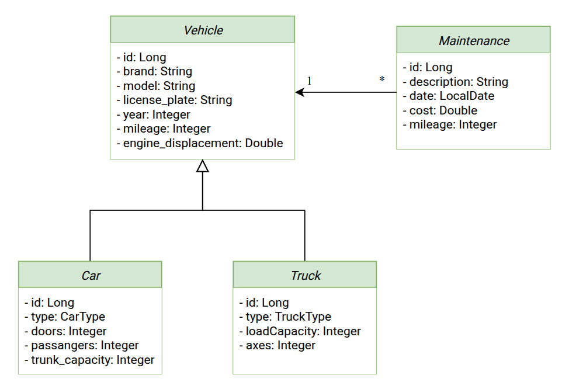
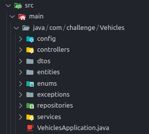
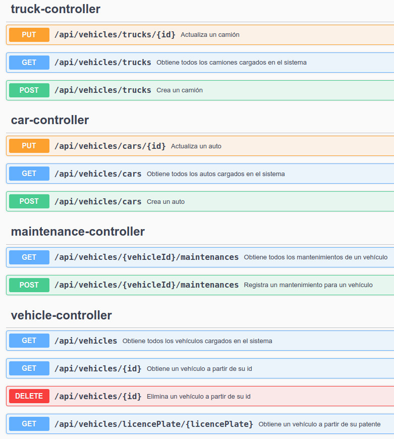

# Desafío Técnico - Vehículos

[](#) [](#) [](#) [](#) [](#) [](#) [](#)

## Diagrama de Clases 📘

<div style="text-align: center;">
  
</div>

## Tecnologías y herramientas utilizadas 🔧

- Java 21
- Spring Boot 3.4.4
- Maven 3.6.3
- MySQL 8.0.41
- Ubuntu 22.04
- Visual Studio Code
- Postman

### Features adicionales

- Manejo global de excepciones.
- Uso de herramienta de logging ([Log4j](https://logging.apache.org/log4j/2.x/index.html)).
- Se implementa [Swagger](https://swagger.io/) para la documentación de la API.
- Se documenta el versionado de acuerdo a la especificación de [Conventional Commits](https://www.conventionalcommits.org/en/v1.0.0/).
- Se realiza el deploy de la aplicación utilizando **Docker** y la nube de **Azure**.

## Estructura del proyecto 📋

Se desarolla una api utilizando Spring Boot y siguiendo una **Arquitectura en Capas**, donde vemos las siguientes carpetas:

- config: Contiene la configuración de ModelMapper.
- controllers: Contiene los controladores de la aplicación.
- dtos: Tiene los dtos separados para cada entidad a la que corresponden.
- enums: Contiene los enums utilizados para indicar el tipo de auto y tipo de camión.
- exceptions: Corresponde a las excepciones personalizadas dentro de la aplicación.
- repositories: Es la capa de repositorios del sistema. Se implementa un único repositorio para la clase Vehículo, puesto que se aprovechan todos los beneficios de la **herencia** y el **polimorfismo**.
- services: Es la capa de servicios de la aplicación, corresponde a la lógica de negocio.

<div style="text-align: center;">
  
</div>

## Descripción de funcionalidades ⚙️

Las funcionalidades disponibles son las siguientes:

1. Crear un vehículo.
2. Modificar un vehículo.
3. Listar todos los vehículos.
4. Obtener un vehículo a partir de su id.
5. Obtener un vehículo a partir de su patente.
6. Eliminar un vehículo.
7. Registrar un mantenimiento para un vehículo.
8. Listar todos los mantenimientos para un vehículo.

Los endpoints disponibles para realizar estas acciones son los siguientes:

<div style="text-align: center;">
  
</div>

## Deploy 🚀

En este repositorio hay una segunda rama llamada **h2-database**. En dicha rama se cambia la base de datos MySQL por una **H2**, con el fin de tener una base de datos en memoria.

Además se agrega un **Dockerfile** necesario para construir la imagen de la aplicación a partir de la rama mencionada.

Se utiliza la nube de **Azure** para desplegar la aplicación con utilizando un contendor de **Docker**.

- Se puede probar el sistema entrando a **Swagger**: https://web-app-vehicles-hxcabrhcfkcybxft.brazilsouth-01.azurewebsites.net/swagger-ui/index.html
- Puede probar los endpoints enviando peticios a esta dirección https://web-app-vehicles-hxcabrhcfkcybxft.brazilsouth-01.azurewebsites.net/ utilizando la colección de **Postman** que se encuentra en el archivo **vehicles_postman_collection.json** dentro de este repositorio.

**_NOTA_**: Es posible que el sistema en Azure demore en responder, puesto que entra en estado de "dormido" luego de un cierto periodo de inactividad.

## Uso del proyecto 📝

Es requisito para ejecutar este proyecto contar con Java, Maven y MySQL instalados. Luego, seguir estos pasos:

1. Clonar el repositorio:

```
git clone https://github.com/PabloMusaber/vehicles-control.git
```

2. Correr el proyecto ejecutando VehiclesApplication.java. Esto además creará una base de datos con el nombre **vehicles**.

3. Importar el dump de la base de datos que se encuentra en el archivo **vehicles_database_dump.sql** en este repositorio. Para eso se puede usar el comando:

```
mysql -u [usuario_sql] -p vehicles < vehicles_database_dump.sql
```

_Nota:_ No es indispensable cargar la base. Sólo contiene datos de muestra que facilitarían su prueba.

4. Con el proyecto funcionando y los datos cargados se puede probar el sistema, para ello puede usar.

**IMPORTANTE**: Puede usar **Postman** con la colección que se encuentra en el archivo **vehicles_postman_collection.json** o puede acceder a **Swagger** desde http://localhost:8080/swagger-ui/index.html con el proyecto en ejecución.
